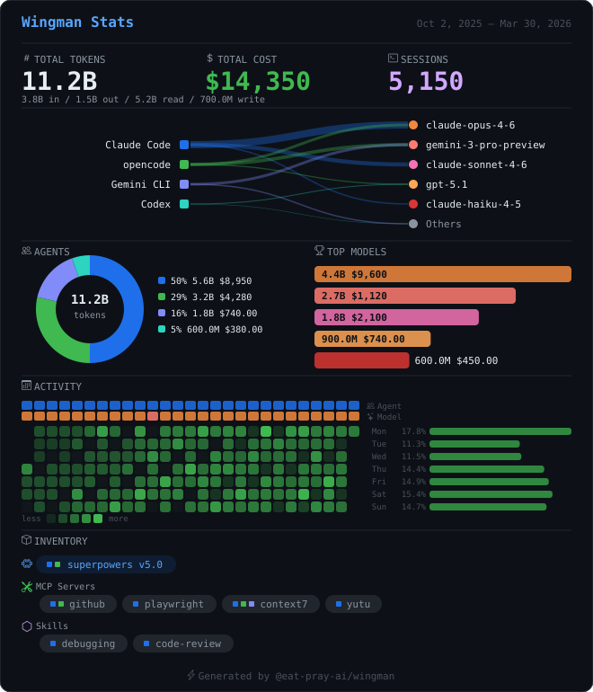

# Wingman

[](https://www.npmjs.com/package/@eat-pray-ai/wingman)
[](https://github.com/eat-pray-ai/wingman/actions/workflows/test.yml)
[](LICENSE)
[](https://linux.do/tag/2234-tag/2234)

Showcase your AI pair usage — SVG cards, résumés, and more.

<table>
  <tr>
    <th align="center">SVG Card</th>
    <th align="center">Résumé (<a href="docs/wingman.pdf">PDF</a>)</th>
  </tr>
  <tr>
    <td align="left"><code>npx @eat-pray-ai/wingman card</code></td>
    <td align="left"><code>npx @eat-pray-ai/wingman resume</code></td>
  </tr>
  <tr>
    <td align="center"></td>
    <td align="center"></td>
  </tr>
</table>

## Supported Agents

| Agent           | Data Source                            | Format |
|-----------------|----------------------------------------|--------|
| **Claude Code** | `~/.claude/projects/*/*.jsonl`         | JSONL  |
| **opencode**    | `~/.local/share/opencode/opencode.db`  | SQLite |
| **Gemini CLI**  | `~/.gemini/tmp/*/chats/session-*.json` | JSON   |
| **Codex**       | `~/.codex/state_5.sqlite`              | SQLite |
| **GitHub Copilot** | VS Code `workspaceStorage/` + `globalStorage/state.vscdb` | JSON + SQLite |
| **MORE**           | Coming soon!                           | TBD    |

## Quick Start

```shell
# Generate an SVG stats card (last 90 days)
npx @eat-pray-ai/wingman card

# Generate a rendercv-compatible YAML résumé (last 180 days)
npx @eat-pray-ai/wingman resume
```

## Commands

### `card` — SVG Stats Card

```shell
# All agents, last 90 days (default)
wingman card

# Specific agents, custom output
wingman card --agents claude-code,opencode -o my-stats.svg

# Date range
wingman card --since 2026-01-01 --until 2026-03-30

# Last 7 days with specific theme
wingman card --days 7 --theme github-dark
```

| Flag         | Short | Default       | Description                         |
|--------------|-------|---------------|-------------------------------------|
| `--output`   | `-o`  | `wingman.svg` | Output file path                    |
| `--theme`    | `-t`  | `github-dark` | Theme name                          |
| `--agents`   |       | all detected  | Comma-separated agent filter        |
| `--since`    |       | 90 days ago   | Start date (YYYY-MM-DD)             |
| `--until`    |       | today         | End date (YYYY-MM-DD)               |
| `--days`     |       | `90`          | Last N days shorthand               |
| `--sections` |       | all           | Comma-separated sections to include |

The default `github-dark` theme renders:

1. **Header** — title + date range
2. **Top Stats** — tokens (input/output/cache breakdown), estimated cost, sessions
3. **Agent Legend** — color-coded bars showing share per agent
4. **Charts** — donut chart (token types) + sparkline (daily activity) + model breakdown bars
5. **Activity Heatmap** — GitHub-style contribution grid for daily usage
6. **Inventory** — plugins, MCP servers, and skills detected across agents
7. **Footer** — branding

### `resume` — rendercv YAML Résumé

```shell
# All agents, last 180 days (default)
wingman resume

# Custom name and headline
wingman resume --name "My Team" --headline "AI Development"

# Specific output path
wingman resume -o my-resume.yaml
```

| Flag         | Short | Default                  | Description                  |
|--------------|-------|--------------------------|------------------------------|
| `--output`   | `-o`  | `resume.yaml`            | Output file path             |
| `--name`     |       | `Wingman`                | Résumé name                  |
| `--headline` |       | `Your AI agents, one résumé` | Résumé headline              |
| `--agents`   |       | all detected             | Comma-separated agent filter |
| `--since`    |       | 180 days ago             | Start date (YYYY-MM-DD)      |
| `--until`    |       | today                    | End date (YYYY-MM-DD)        |
| `--days`     |       | `180`                    | Last N days shorthand        |

The generated YAML follows the [rendercv](https://rendercv.com/) schema with sections:

- **Summary** — agent count, total tokens, sessions, cost
- **Experience** — one entry per agent (sorted by usage), with model breakdowns
- **Education** — models grouped by AI lab (Anthropic, Google, OpenAI, etc.)
- **Technologies** — plugins, MCP servers, skills inventory

Render ai résumé at [rendercv.com](https://rendercv.com/).

## How It Works

```
Agent Adapters → UsageRecord[] → Aggregator → ShowcaseData → Renderer → SVG / YAML
```

1. **Agent adapters** read local data from each AI coding agent (JSONL, SQLite, JSON)
2. **Aggregator** groups by agent, calculates totals, builds per-model and daily breakdowns
3. **Pricing engine** fetches model costs from [models.dev](https://models.dev) (24h disk cache) to estimate spend
4. **Renderers** produce output:
   - **Theme renderer** → self-contained SVG string (embeddable anywhere)
   - **Résumé renderer** → rendercv-compatible YAML

## Development

```shell
npm install
npm run dev -- card --days 30        # run directly via tsx
npm run dev -- resume                # generate résumé YAML
npm run build                        # bundle to dist/
npx tsc --noEmit                     # type-check
npm test                             # vitest
```

See [AGENTS.md](AGENTS.md) for code style and architecture details.

## Extending

### Add a new agent adapter

1. Create `src/agents/my-agent.ts` implementing `AgentAdapter`
2. Register in `src/agents/registry.ts`

### Add a new theme

1. Create `src/themes/my-theme/index.ts` implementing `ThemeRenderer`
2. Register in `src/themes/registry.ts`

## License

MIT
